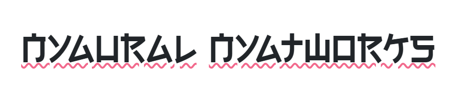

[//]: # (![]&#40;nya_app/nya_vue/public/logo.png&#41;)

# Презентация


[](https://youtu.be/uRkytINHSEg)

# Api
## Модели
`GET` /models/ - список моделей
### Пример ответа
 ```json
[
  {
        "local_name": "blanchefort_rubert_sentiment",
        "local_path": "nya_ml.models.blanchefort_rubert_sentiment",
        "name": "RuBert by blanchefort",
        "class_name": "BlanchefortRuBertSentiment",
        "target": "sentiment"
    },
    {
        "local_name": "tatyana_rubert_sentiment",
        "local_path": "nya_ml.models.tatyana_rubert_sentiment",
        "name": "RuBert by Tatyana",
        "class_name": "TatyanaRuBertSentiment",
        "target": "sentiment"
    },
    {
        "local_name": "sismetanin_rubert_toxic",
        "local_path": "nya_ml.models.sismetanin_rubert_toxic",
        "name": "RuBert by sismetanin",
        "class_name": "SismetaninRuBertToxic",
        "target": "toxic"
    }
]
```
## Анализ
`GET` /predict/
### Параметры
- **input**: тип ввода (auto, vk, youtube, ...)
- **text**: что анализировать (текст или ссылка)
- **expand**: путь ветки сообщений
- **toxic**: local_name модели анализа токсичности
- **sentiment**: local_name модели анализа эмоциональности
- **sarcasm**: local_name модели анализа саркастичности
- **page**: номер страницы для пагинации (если 0, то все комментарии на одной странице)
- **per_page**: количество комментариев на странице
- **stats**: статистика по сообщениям
### Пример ответа
`GET` /predict/?input=auto&text=https://vk.com/...&toxic=SkolkovoInstitute_russian_toxicity_classifier&sentiment=blanchefort_rubert_sentiment&page=2&per_page=3&expand=7748.../
```json
{
    "models": {
        "toxic": "SkolkovoInstitute_russian_toxicity_classifier",
        "sentiment": "blanchefort_rubert_sentiment"
    },
    "grads": {
        "toxic": {
            "no toxic": 0,
            "toxic": 2
        },
        "sentiment": {
            "neutral": 1,
            "positive": 0,
            "negative": 2
        }
    },
    "items": [
        {
            "id": "7748....",
            "text": "Тебя ****?",
            "author": {
                "name": "Danil...",
                "photo": "..."
            },
            "date": "2022-02-04",
            "level": 1,
            "predictions": {
                "toxic": {
                    "no toxic": 0.006265629082918167,
                    "toxic": 0.9937344193458557
                },
                "sentiment": {
                    "neutral": 0.365639865398407,
                    "positive": 0.002537169959396124,
                    "negative": 0.631822943687439
                }
            },
            "comments": 0
        },
        {
            "id": "77487392",
            "text": "Кому я обещал?",
            "author": {
                "name": "Kirill...",
                "photo": "..."
            },
            "date": "2022-02-04",
            "level": 1,
            "predictions": {
                "toxic": {
                    "no toxic": 0.9088267087936401,
                    "toxic": 0.09117330610752106
                },
                "sentiment": {
                    "neutral": 0.9958908557891846,
                    "positive": 0.0015624066581949592,
                    "negative": 0.0025467220693826675
                }
            },
            "comments": 3
        },
        {
            "id": "77487393",
            "text": "да сука я только проснулся, админ иди *****",
            "author": {
                "name": "Yura...",
                "photo": "..."
            },
            "date": "2022-02-04",
            "level": 1,
            "predictions": {
                "toxic": {
                    "no toxic": 0.0035801068879663944,
                    "toxic": 0.9964199066162109
                },
                "sentiment": {
                    "neutral": 0.015688661485910416,
                    "positive": 0.0017586981412023306,
                    "negative": 0.9825526475906372
                }
            },
            "comments": 0
        }
    ],
    "path": "7748....//",
    "per_page": 3,
    "page": 2,
    "count": 3
}
```