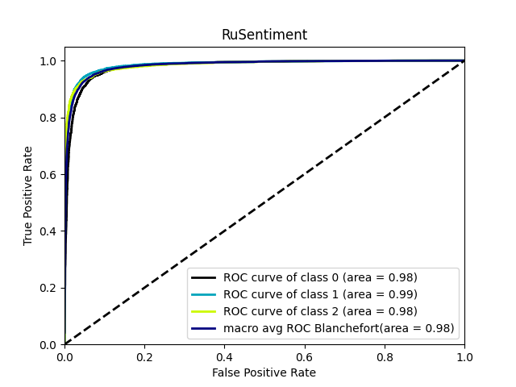
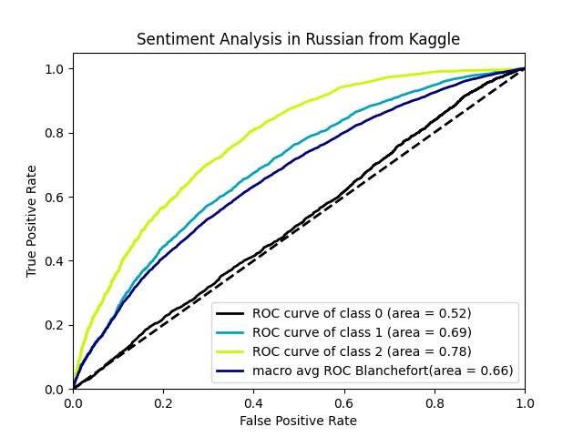

## Rusentiment
> RuSentiment dataset for sentiment analysis of Russian social media
```
              precision    recall  f1-score   support

           0       0.94      0.94      0.94      8323
           1       0.91      0.93      0.92      4635
           2       0.92      0.85      0.88      2294

    accuracy                           0.93     15252
   macro avg       0.92      0.91      0.91     15252
weighted avg       0.93      0.93      0.93     15252
```


## Sentiment Analysis in Russian
> Determine sentiments (positive, negative or neutral) of news in russian language.
```
              precision    recall  f1-score   support

           0       0.49      0.99      0.66      4034
           1       0.76      0.02      0.04      2795
           2       0.65      0.01      0.02      1434

    accuracy                           0.49      8263
   macro avg       0.63      0.34      0.24      8263
weighted avg       0.61      0.49      0.34      8263
```

