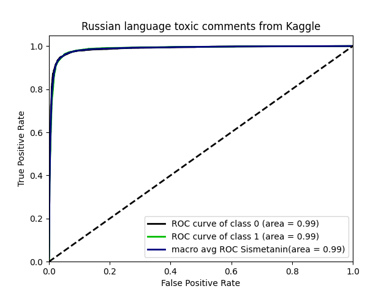
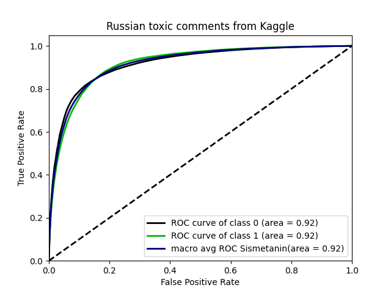

## Russian Language Toxic Comments
> Small dataset with labeled comments from 2ch.hk and pikabu.ru
```
              precision    recall  f1-score   support

           0       0.97      0.97      0.97      9586
           1       0.93      0.94      0.93      4826

    accuracy                           0.96     14412
   macro avg       0.95      0.95      0.95     14412
weighted avg       0.96      0.96      0.96     14412
```

## Toxic Russian Comments
> Labelled comments from the popular Russian social network
```
              precision    recall  f1-score   support

           0       0.98      0.68      0.81    203685
           1       0.40      0.94      0.56     44605

    accuracy                           0.73    248290
   macro avg       0.69      0.81      0.68    248290
weighted avg       0.88      0.73      0.76    248290
```

