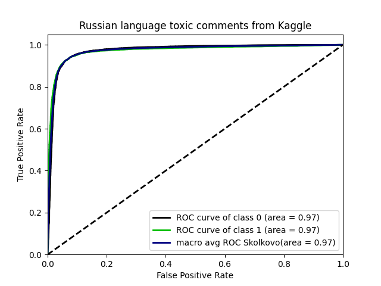
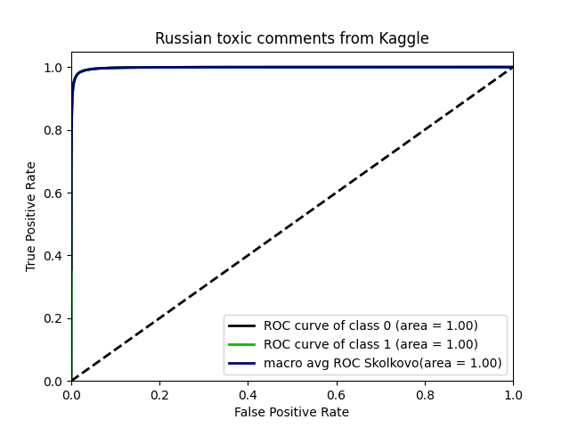

## Russian Language Toxic Comments
> Small dataset with labeled comments from 2ch.hk and pikabu.ru
```
              precision    recall  f1-score   support

           0       0.93      0.97      0.95      9586
           1       0.93      0.86      0.90      4826

    accuracy                           0.93     14412
   macro avg       0.93      0.92      0.92     14412
weighted avg       0.93      0.93      0.93     14412
```

## Toxic Russian Comments
> Labelled comments from the popular Russian social network
```
              precision    recall  f1-score   support

           0       0.99      0.99      0.99    203685
           1       0.96      0.96      0.96     44605

    accuracy                           0.99    248290
   macro avg       0.98      0.97      0.98    248290
weighted avg       0.99      0.99      0.99    248290
```


