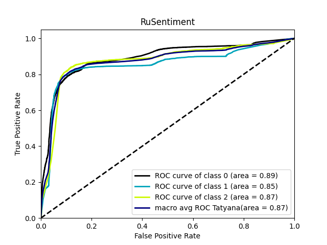
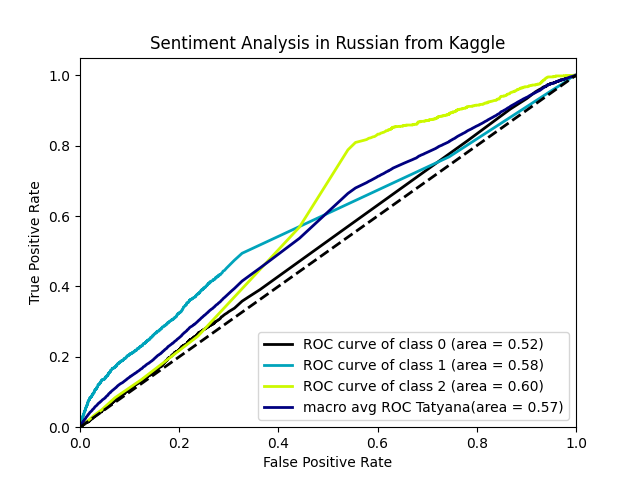

## Rusentiment
> RuSentiment dataset for sentiment analysis of Russian social media
```
              precision    recall  f1-score   support

           0       0.90      0.79      0.84      8323
           1       0.80      0.78      0.79      4635
           2       0.57      0.83      0.68      2294

    accuracy                           0.80     15252
   macro avg       0.76      0.80      0.77     15252
weighted avg       0.82      0.80      0.80     15252
```


## Sentiment Analysis in Russian
> Determine sentiments (positive, negative or neutral) of news in russian language.
```
              precision    recall  f1-score   support

           0       0.51      0.28      0.36      4034
           1       0.63      0.11      0.19      2795
           2       0.22      0.85      0.35      1434

    accuracy                           0.32      8263
   macro avg       0.45      0.42      0.30      8263
weighted avg       0.50      0.32      0.30      8263
```

